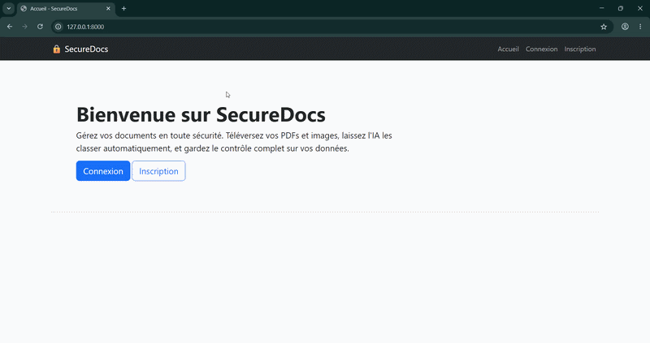
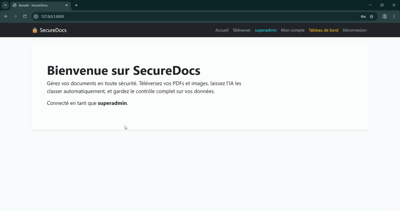
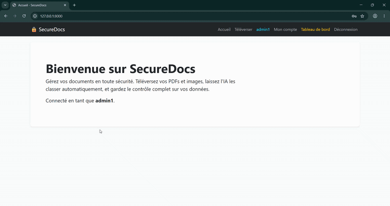
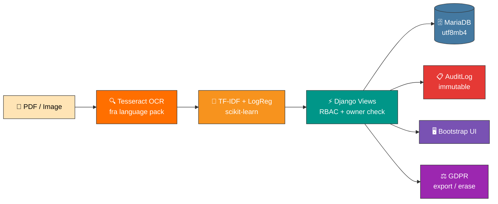

<div align="center">

# 🔐 SecureDocs

**Django document manager with AI classification, audit logging, and GDPR-grade data rights**

[](https://www.python.org/)
[](https://www.djangoproject.com/)
[](https://mariadb.org/)
[](https://scikit-learn.org/)
[](https://github.com/tesseract-ocr/tesseract)
[](https://pypi.org/project/bcrypt/)
[](https://getbootstrap.com/)

>End-of-study internship at the Faculty of Sciences and Technologies of Marrakech · École Racine · Jul – Aug 2023

</div>

---

## 🎯 What it does

Users upload PDFs and images. Tesseract extracts the text, a TF-IDF + LogisticRegression classifier sorts each document into Invoice, ID, Contract, or Other. Three roles see different things: regular users manage their own docs, staff admins get a dashboard with audit log, and a superadmin gets full Django admin access. Every action lands in an immutable audit log. Users can export their data as a ZIP or permanently erase it which deletes files off disk, not just database rows.

---

## 🖥️ App walkthrough

<div align="center">



*User*

</div>

---

## ⚡Super Admin & Admin

<div align="center">

<table>
<tr>
<td align="center" width="55%">

**Super-Admin**



</td>
<td align="center" width="45%">

**Admin**



</td>
</tr>
</table>

*Tesseract extracts the text, the classifier predicts the category, and the result lands in the user's private document list. A different user logs in and sees nothing owner FK check on every view.*

</div>

---

## 🧰 Tech stack

| Layer | Technology |
|---|---|
| 🤖 **AI / NLP** | scikit-learn · TF-IDF · LogisticRegression · joblib |
| 📄 **OCR** | Tesseract v5.5.0 · pytesseract · pdf2image · Poppler |
| ⚡ **Backend** | Django 4.2 LTS · mysqlclient 2.2 · python-decouple |
| 🔐 **Auth** | bcrypt (BCryptSHA256PasswordHasher, cost 12) · RBAC · lockout |
| 🗄️ **Database** | MariaDB 10.4 via XAMPP · utf8mb4 · Africa/Casablanca timezone |
| 📋 **Audit & GDPR** | Immutable AuditLog · `os.remove` cascade · JSON + files ZIP export |
| 🖥️ **Frontend** | Bootstrap 5 · Django templates · no JS framework |
| 📦 **Dataset** | Faker (fr_FR) · reportlab 80 synthetic + 20 real PDFs |

---

## 🏗️ Architecture


---

## 👥 User roles

| Role | What they can do |
|---|---|
| **User** | Upload, view own docs, download, export/delete own data |
| **admin1 (staff)** | Everything above + dashboard with audit log + user list |
| **superadmin** | Everything above + Django admin panel + full audit access |


---

## 🚀 Quick start

### Prerequisites
- Python 3.11.9 (pyenv recommended)
- XAMPP with MariaDB 10.4 running on port 3306
- Tesseract v5+ with the `fra` language pack
- Poppler (for PDF → image conversion)

### 1️⃣ Clone & set up

```bash
git clone https://github.com/Nizar7kabbaj/securedocs.git
cd securedocs
python -m venv venv
venv\Scripts\Activate.ps1        # Windows PowerShell
pip install -r requirements.txt
```

### 2️⃣ Configure

Copy `.env.example` to `.env` and fill in:

```env
DJANGO_SECRET_KEY=<random 50-char secret>
DB_NAME=securedocs
DB_USER=root
DB_PASSWORD=
DB_HOST=127.0.0.1
DB_PORT=3306
DEBUG=True
TESSERACT_CMD=C:\Users\<you>\AppData\Local\Programs\Tesseract-OCR\tesseract.exe
POPPLER_PATH=C:\Users\<you>\AppData\Local\Programs\poppler\Library\bin
```

### 3️⃣ Migrate & seed

```bash
# Create the database in phpMyAdmin first (utf8mb4 charset)
python manage.py migrate
python manage.py createsuperuser
```

### 4️⃣ Train the classifier

```bash
python classifier/generate_dataset.py   # 80 synthetic French PDFs
python classifier/train.py              # saves classifier/model.pkl
```

### 5️⃣ Run

```bash
python manage.py runserver
```

Open `http://127.0.0.1:8000`.

> The trained model file (`classifier/model.pkl`) is generated locally on first train. It's not tracked in Git.

---

## 🔐 Security posture

| Layer | What's in place |
|---|---|
| Passwords | bcrypt cost 12 via `BCryptSHA256PasswordHasher`, DB prefix `bcrypt_sha256$$2b$12$` |
| Access control | `is_staff` gates dashboard · `@login_required` + owner FK check on every doc view |
| Brute-force lockout | 5 failed logins in 15 min → 15-min lockout · counter reads existing audit entries |
| Session policy | 30-min idle timeout · expires on browser close · enforced server-side |
| CSRF | Django middleware · `CSRF_COOKIE_HTTPONLY = True` |
| Browser hardening | X-Frame-Options DENY · nosniff · HSTS + secure cookies gated by `if not DEBUG` |
| Audit trail | Immutable `has_add/change/delete_permission = False` for all roles · survives user deletion via `SET_NULL` |
| GDPR Art. 17 | Delete cascades DB rows AND files on disk via explicit `os.remove()` loop · audit row written before user wipe |

---

## 📊 Classifier numbers

| Metric | Result |
|---|---|
| Classes | Invoice · ID · Contract · Other |
| Training set | ~80 synthetic French PDFs + ~20 real anonymized samples |
| Pipeline | `TfidfVectorizer` → `LogisticRegression` → `joblib.dump` |
| Language | French only |
| Full report | [`classifier/reports/classification_report.txt`](classifier/reports/classification_report.txt) |
| Confusion matrix | [`classifier/reports/confusion_matrix.png`](classifier/reports/confusion_matrix.png) |

Full results in [`classifier/reports/`](classifier/reports/).

---

## 📁 Repository structure

```
securedocs/
├── 🔐 accounts/          # registration, login, logout, RBAC decorator
├── 📄 documents/         # upload, OCR pipeline, list, detail, download
├── 🤖 classifier/
│   ├── generate_dataset.py    # Faker + reportlab synthetic PDFs
│   ├── train.py               # TF-IDF + LogReg pipeline
│   ├── inference.py           # loads model.pkl, predicts category
│   └── reports/               # classification_report.txt, confusion_matrix.png
├── 📋 audit/             # AuditLog model, middleware, log_action helper
├── 📊 dashboard/         # staff-only stats + audit log view
├── ⚖️  gdpr/             # export-my-data, delete-my-data, account page
├── 🖥️  templates/        # base.html + per-app templates
├── ⚙️  securedocs/       # Django project settings, urls.py
└── 📖 docs/              # screenshots and GIFs
```

---

## 📅 Roadmap

| Phase | Scope | Status |
|---|---|---|
| 1️⃣ | Django foundation · auth · Bootstrap templates · MySQL setup | ✅ Done |
| 2️⃣ | Document upload · Tesseract OCR · per-user isolation | ✅ Done |
| 3️⃣ | Synthetic dataset (Faker + reportlab) · TF-IDF + LogReg classifier | ✅ Done |
| 4️⃣ | Audit logging · staff dashboard · GDPR export & erase endpoints | ✅ Done |
| 5️⃣ | bcrypt hashing · brute-force lockout · security headers · session policy | ✅ Done |

---

## 🎓 What I learned

This was my first time building a Django project where security and data rights weren't optional. A few things that actually stuck:

- **GDPR Art. 17 is not just a database delete** — `on_delete=CASCADE` removes the DB row but leaves the PDF on disk. An explicit `os.remove()` loop in the delete view is the only way to genuinely fulfill the right to erasure.
- **Audit log FK design matters more than it looks** — `on_delete=SET_NULL` on the user FK keeps deleted users' history as pseudonymized rows, which is what Art. 17 actually calls for. `CASCADE` would erase exactly the records you need most.
- **Lockout without a library** — the audit log already stores `LOGIN_FAILED` events. The brute-force counter is a query against existing data — no new model, no `django-axes`, about 30 lines.
- **Order of operations on account deletion** — write the audit row first (username still real), logout second, delete last. Reversing any two creates a subtle bug where the audit row references an `AnonymousUser`.
- **Lockout gate must run BEFORE `authenticate()`** — putting the check after means a correct password during a lockout window still logs the user in.

**Skills I came out with:**

`Django 4.2` · `MySQL / MariaDB` · `scikit-learn` · `Tesseract OCR` · `pdf2image` · `bcrypt` · `RBAC` · `Audit logging` · `GDPR Art. 17` · `TF-IDF` · `joblib` · `python-decouple` · `Faker` · `reportlab` · `Bootstrap 5`

---

## 🙏 Acknowledgements

**M. Khalid Ait Ben Hamou** — my supervisor at École Racine Marrakech. His teaching of the Django/Python/MySQL stack in 2023 is the technical foundation this project is built on. The discipline of "make it work end-to-end before making it pretty" came from his classroom.

**Mme. Rahil Imane** — my internship supervisor at FSTG Marrakech (Jul – Aug 2023). Her feedback pushed me to document limitations honestly rather than hide behind feature lists. That discipline shaped how I write about technical work.

Thank you both.

---

## ⚠️ Honest limitations

The classifier is trained on ~100 French documents (80 synthetic + 20 real). It works on clean scanned PDFs. Phone camera photos of documents produce unreliable OCR output that's a Tesseract input quality constraint, not a model bug.

This runs on a single Windows machine with XAMPP no Docker, no cloud, no production hardening beyond what the `if not DEBUG` block activates. Treat confidence scores as guidance, not ground truth.

Both are documented in full: [`classifier/reports/classification_report.txt`](classifier/reports/classification_report.txt)

---

## 👤 Author

**Nizar Kabbaj** — End-of-study internship at FSTG Marrakech · École Racine · 2023
🔗 GitHub: [@Nizar7kabbaj](https://github.com/Nizar7kabbaj)

---

<div align="center">

⭐ If this project was useful to you, a star on the repo is appreciated.

</div>
